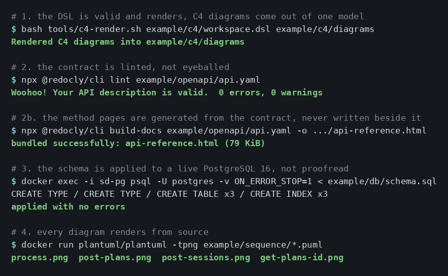
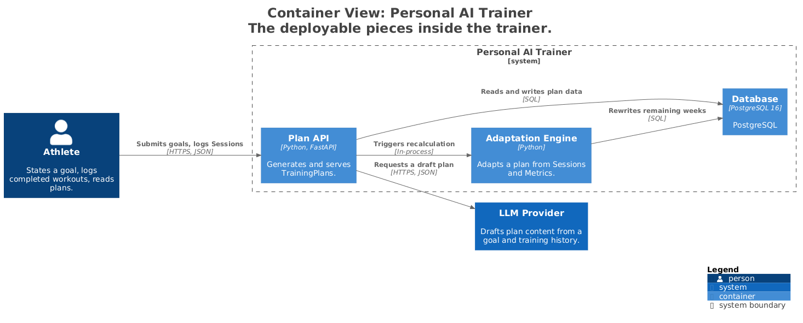
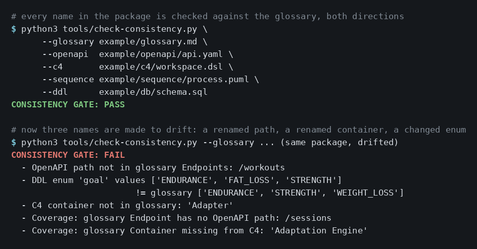

# System Design from a Stakeholder Interview

*Turn one conversation into a design package an agent can build from.*

**A reproducible process. From a single conversation with a stakeholder, in one pass, you
assemble a coherent package of design artifacts:** business requirements, C4, OpenAPI,
sequence diagrams, DDL, and ADRs. The human leads and verifies; an AI agent drafts from
templates and holds the "do not invent" line.

The AI accelerates the documentation. The architectural decisions, the numbers, and the names
stay with the analyst, and the tools validate them.

> This repo ships the method, the templates, the toolchain, and one complete package built with
> them: a **personal AI trainer**, in [`example/`](example). Every artifact in it was validated by
> the tools, not by eye. Clone it, drop in your own domain, repeat.

## Who it's for

- Systems analysts who assemble design documentation and want to do it faster without losing rigor.
- People who orchestrate an AI agent and are tired of the agent inventing entities that don't exist.
- Anyone who needs a coherent package where names and contracts agree across every artifact. The
  usual failure is six documents that each look fine and contradict each other.

## Where this sits: Spec-Driven Development

This is an instance of **Spec-Driven Development** (SDD), where an executable, versioned
specification, not the code, is the single source of truth. SDD is now a whole category of tools,
from large vendors and small teams alike: spec-kit, AWS Kiro, Cursor Plan Mode, OpenSpec, BMAD,
Tessl, and more. They answer the failure of "vibe coding," where agents emit plausible code that
drifts from intent and hallucinates APIs.

**What this method adds is the stage those tools assume already done: step 0, the stakeholder
interview.** They all start from a spec that already exists. This one starts one step earlier, in
a conversation where the requirements don't exist yet and are drawn out by asking. That is analyst
work, validated by a human at every step. The method is tool-agnostic: it builds the front-stage
package, and at step 10 you hand that package to any SDD tool, to a coding agent, or to a developer.

**On human gates, a common argument.** The objection is that 2026 models run the steps
autonomously, cheaper and faster, so mid-pipeline gates are just friction. The answer is that
this conflates autonomy of execution with autonomy of decision. Gates exist because enterprise
software runs under risk management, compliance, and governance. The agent's capability isn't the
question; the ability to amplify an error is. That ability scales with the ability to create value.
In a regulated environment, the requirements-verification gate is what makes the pipeline usable.

## Five principles

1. **Why before how.** Requirements come before architecture; the API and the data model are
   derived from them. An error in requirements multiplies downward, so requirements are a gate.
2. **Do not invent.** What the source didn't state doesn't enter an artifact. It goes to the
   open-questions register marked as an assumption. A primary source closes the gap, not a guess.
3. **Forks go to an ADR.** Hit a real choice (transport, trigger, where the AI runs) and don't
   stall. Mark it an ADR candidate, park it, move on, record it.
4. **A checkpoint after every step.** Don't generate the whole package at once. Small,
   reviewable slices, and diff each one.
5. **Validate with tools.** Every artifact is run through a real tool: a linter, a schema
   compiler, a live DB, a renderer.

Full principles the agent reads live in [`CONSTITUTION.md`](CONSTITUTION.md).

## Pipeline

**Step 0 is what SDD frameworks don't have.** The pipeline starts not from a ready spec but
from an interview. The requirements don't exist yet, they're extracted by asking along 6 axes.
From there it's the standard SDD path downward.

| # | Step | Output | Guide |
|---|------|--------|-------|
| 0 | **Interview** along 6 axes (goal+metric, scenarios, sources, functional, non-functional, acceptance) | audio recording | [guide/0](guide/0-interview.md) |
| 1 | Transcription (Whisper or any transcriber) | `.txt` | [guide/1](guide/1-transcription.md) |
| 2 | Business requirements (19 sections) plus open questions, seed the glossary | `md`, `glossary.md` | [guide/2](guide/2-business-requirements.md) |
| 3 | Gate, where a human verifies the requirements and classifies what is missing | package state, clarification summary | [guide/3](guide/3-gate.md) |
| 4 | An ADR per fork | `adr/ADR-000N.md` | [guide/4](guide/4-adr.md) |
| 5 | C4, Context plus Containers | `png` + `dsl` | [guide/5](guide/5-c4.md) |
| 6 | OpenAPI (YAML-first) plus a method summary | `yaml` | [guide/6](guide/6-openapi.md) |
| 7 | Sequence, the end-to-end process plus one diagram per contract method | `puml` + `png` | [guide/7](guide/7-sequence.md) |
| 8 | DDL, the data model | `sql` | [guide/8](guide/8-ddl.md) |
| 9 | Consistency gate, `tools/check-consistency` plus the AI-review checklist | verdict A to F | [checklists/ai-review](checklists/ai-review.md) |
| 10 | Close out the register, then hand the package to a coding agent | working software | [guide/10](guide/10-implementation.md) |

## Cross-artifact consistency (what the review catches first)

The same names for entities, fields, and endpoints across all artifacts. Every FR maps to an
endpoint or a system flow. Every requirement entity maps to a DDL table. OpenAPI tags equal C4
containers. Sequence participants equal C4 containers plus OpenAPI endpoints. Consistency beats
the polish of any single artifact.

The backbone is the [glossary](templates/glossary.md): every entity, enum, endpoint, and
container is named there once, and every artifact draws names from it. Consistency holds by
construction, because the agent pulls names from a single list, so drift cannot start.

Step 9 is an executable gate. `tools/check-consistency` verifies the
artifacts against the glossary in both directions: conformance (every name used exists in the
glossary) and coverage (every glossary name is actually built). It fails on any mismatch. That is
the difference between "I checked" and "it's checked."

## Toolchain

| Artifact | Tool | Check |
|----------|------|-------|
| Transcript | Whisper (or any transcriber) | (none) |
| Requirements, ADR | Markdown from templates | human review |
| C4 | Structurizr DSL, C4-PlantUML (Docker) | DSL validates, PNG/SVG render |
| OpenAPI | YAML, `@redocly/cli lint` | 0 linter errors |
| Sequence | PlantUML (Docker) | render from source |
| DDL | SQL, PostgreSQL 16 (Docker) | applies on a live DB |
| The whole package | `tools/check-consistency.py` | glossary conformance and coverage |

Two of these ship as runnable scripts in [`tools/`](tools): the consistency gate and the C4
renderer. The rest are standard tools driven by the commands in
[`tools/README.md`](tools/README.md).

Here is the toolchain running end to end over the example package:



## The example package

[`example/`](example) is a full package built by this method for a personal AI trainer: glossary,
business requirements, two ADRs, a Structurizr model with rendered Context and Container views, an
OpenAPI contract, four sequence diagrams, and PostgreSQL DDL.



It exists so the claim "validated by tools" can be checked rather than believed. The consistency
gate passes over the package, and fails with the exact drift as soon as a single name diverges:



Reproduction commands are in [`example/README.md`](example/README.md).

## Getting started

```bash
git clone https://github.com/Svetafo/system-design-from-interview.git
cd system-design-from-interview
```

**What you need.** Docker for the C4 renderer, PlantUML and the database check; Node.js for the
OpenAPI linter (via `npx`, nothing installed globally); Python 3 with PyYAML for the gate. A
transcriber such as Whisper for step 1.

PyYAML is the one thing the gate imports, and only on the `--openapi` branch, so a gate run without
a contract works on a bare Python 3. Install it into a virtualenv beside the clone rather than into
the system Python:

```bash
python3 -m venv .venv && .venv/bin/pip install PyYAML
.venv/bin/python tools/check-consistency.py ...
```

**Point your agent at the repo.** [`AGENTS.md`](AGENTS.md) is the entry point: coding agents pick it
up on their own, and if yours does not, hand it that file plus
[`CONSTITUTION.md`](CONSTITUTION.md). A browser chat can draft the artifacts but cannot run the
tools, so someone has to run them before the package is trusted.

On Claude Code there is also a ready skill, [`skills/system-design-docs`](skills/system-design-docs),
which drives the pipeline itself, running each tool at its step instead of being reminded to. Install
it by pointing `~/.claude/skills/` at your clone rather than copying the folder, because the skill
reads the templates and tools from the repository:

```bash
ln -s "$(pwd)/skills/system-design-docs" ~/.claude/skills/system-design-docs
export SD_METHOD_REPO="$(pwd)"          # optional, add to your shell profile
```

Run both from the root of your clone. Without `SD_METHOD_REPO` the skill asks where the clone is on
first use. It writes artifacts into whatever project you are working in; the repository itself stays
read-only and supplies the formats and the validators.

If `ln` reports `File exists`, you already have a skill by that name. Rename or remove yours first,
or symlink this one under a different name: the last path segment is what the agent will call it.

A second skill, [`skills/question-triage`](skills/question-triage), works the open-questions register
rather than the pipeline: it sorts entries into what a primary source can close, what only a person
can decide, and what is already answered elsewhere, then closes the first kind by going and looking.
It never closes the second, and the reason is in its own file. Install it the same way.

Then work the pipeline, one artifact at a time, stopping for review after each:

1. **Interview** (step 0, yours, not the agent's). Run it with
   [`checklists/interview.md`](checklists/interview.md) and
   [`templates/interview-questions.md`](templates/interview-questions.md). Record it.
2. **Transcribe** (step 1). Whisper or any transcriber. The transcript is what the agent starts from.
3. **Requirements** (step 2). The agent fills `business-requirements.md` and `open-questions.md`, and
   seeds the glossary with entities and enums.
4. **Verify the requirements** (step 3). This gate is yours and it is not optional: an error here
   multiplies into every artifact below.
5. **ADRs** (step 4), one per real fork.
6. **C4** (step 5). Write the Structurizr DSL, render it with `tools/c4-render.sh`, add the
   containers to the glossary.
7. **Contract** (step 6). Method summary, then the YAML, then a page per method. Lint it, generate
   the reference, add the endpoints to the glossary.
8. **Sequence** (step 7) and **DDL** (step 8). Render every diagram; apply the schema to a live
   PostgreSQL.
9. **Gate** (step 9). Run `tools/check-consistency.py` and walk
   [`checklists/ai-review.md`](checklists/ai-review.md).
10. **Hand off** (step 10). [`guide/10-implementation.md`](guide/10-implementation.md) covers passing
    the package to a coding agent, a developer, or an SDD tool.

Every step has its own guide in [`guide/`](guide), and [`example/`](example) shows what each artifact
looks like when it is finished and validated.

Runs that are not one pass, a backlog instead of an interview, missing access to code or a database,
or answers arriving a week after the gate asked, are covered in [`SCENARIOS.md`](SCENARIOS.md).

## Context engineering (built into the method)

- **Write.** The open-questions register as external memory against hallucination.
- **Isolate.** One artifact at a time, so an error doesn't flow onward.
- **Compress and select.** Templates and the "do not invent" rule as the output format.
- **On conflicting sources.** Name the authoritative one (contract or code), not a circular
  reference to your own analysis.

## License

MIT.

Method by Svetlana Fomina.
