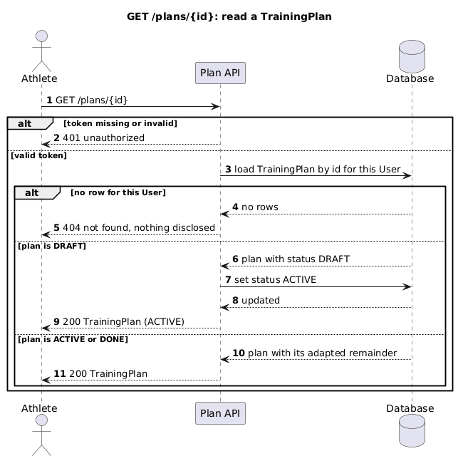

# GET Read a TrainingPlan

Returns a TrainingPlan including its adapted remainder. The first successful read moves a DRAFT plan
to ACTIVE, which is how a generated plan becomes the one in force (FR-2).

## Identification

| Method | Path | operationId |
|---|---|---|
| GET | /plans/{id} | getPlan |

## Document history

| Date | Task | Description | Author |
|---|---|---|---|
| 2026-07-30 | example package | Initial version | Svetlana Fomina |

## Request

### Path and query parameters

| Parameter | In | Type | Required | Description |
|---|---|---|---|---|
| id | path | string (uuid) | required | TrainingPlan identifier. |

### Body

None.

## Response

### Body

| Field | Type | Description |
|---|---|---|
| id | string (uuid) | Identifier of the TrainingPlan. |
| owner | object (User) | The User the plan belongs to, always the caller. |
| goal | string (Goal) | The goal the plan was generated for. |
| status | string (PlanStatus) | ACTIVE after the first read, DONE once the last week completes. |
| weeks | integer | Plan length in weeks. |
| createdAt | string (date-time) | When the plan was stored. |
| adaptedAt | string (date-time) or null | When the Adaptation Engine last rewrote the remainder. |

### Status codes

| Code | Condition | Description |
|---|---|---|
| 200 | Success | The TrainingPlan, with its adapted remainder. |
| 401 | Bearer token missing or invalid | Not authenticated. |
| 404 | No such plan for this User | Nothing is disclosed about other Users' plans. |

## Diagram

[`sequence/get-plans-id.puml`](../../sequence/get-plans-id.puml)

## Flow

| Step | Description | Error handling | Comment |
|---|---|---|---|
| 1 | Resolve the Athlete from the bearer token | If the token is missing or invalid, then return 401 | |
| 2 | Load the TrainingPlan by id, restricted to this Athlete | If no row is found, then return 404 with no detail | UC-3, a plan of another User is indistinguishable from a plan that does not exist |
| 3 | If the status is DRAFT, set it to ACTIVE | No conflict is possible: a competing unfinished plan cannot exist, ADR-0002 | FR-2, the first read is a write, not a pure read |
| 4 | Return 200 with the plan and its adapted remainder | | |

---

**How this relates to the contract.** Field names, types and status codes come from
[`api.yaml`](../api.yaml). What this page adds is the DRAFT to ACTIVE transition and the disclosure
rule, which the contract cannot express.
