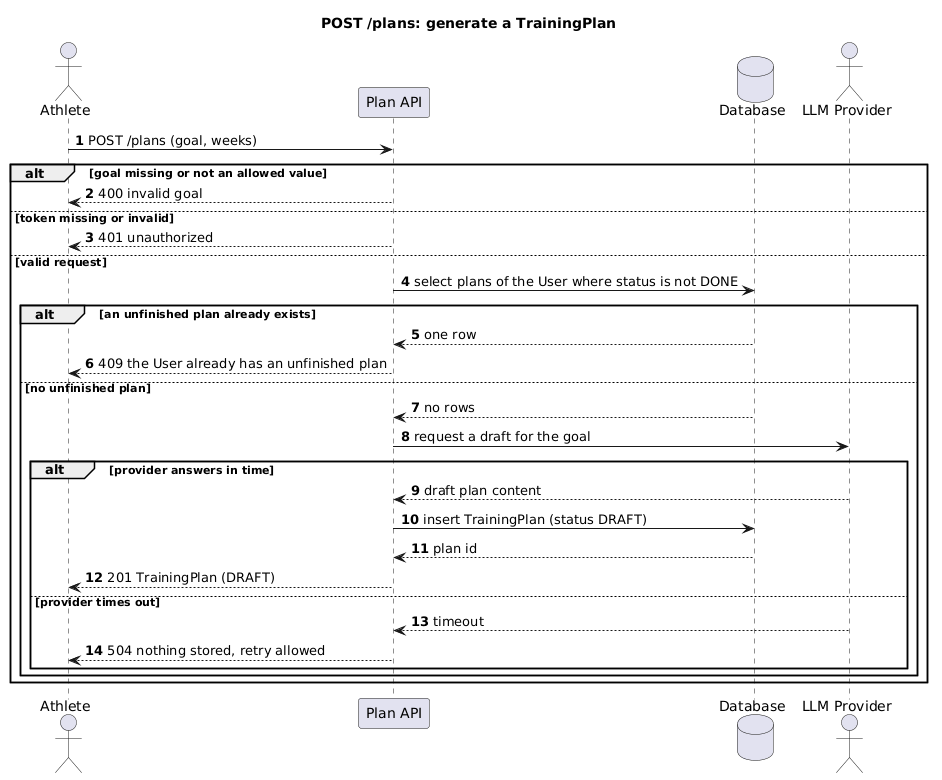

# POST Generate a TrainingPlan

Generates a TrainingPlan for the authenticated Athlete from a stated Goal. The plan is drafted by
the LLM Provider, stored with status DRAFT, and becomes ACTIVE on its first read.

## Identification

| Method | Path | operationId |
|---|---|---|
| POST | /plans | createPlan |

## Document history

| Date | Task | Description | Author |
|---|---|---|---|
| 2026-07-30 | example package | Initial version | Svetlana Fomina |

## Request

### Path and query parameters

None. The owner is taken from the bearer token, never from the request.

### Body

| Field | Required | Type | Values | Description |
|---|---|---|---|---|
| goal | required | string (Goal) | STRENGTH, ENDURANCE, WEIGHT_LOSS | The training goal stated by the Athlete. |
| weeks | optional | integer | 1 to 24, default 8 | Plan length in weeks. |

## Response

### Body

| Field | Type | Description |
|---|---|---|
| id | string (uuid) | Identifier of the created TrainingPlan. |
| owner | object (User) | The User the plan belongs to. |
| goal | string (Goal) | The goal the plan was generated for. |
| status | string (PlanStatus) | DRAFT on creation. |
| weeks | integer | Plan length in weeks. |
| createdAt | string (date-time) | When the plan was stored. |
| adaptedAt | string (date-time) or null | Null until the Adaptation Engine rewrites the remainder. |

### Status codes

| Code | Condition | Description |
|---|---|---|
| 201 | Success | TrainingPlan generated and stored with status DRAFT. |
| 400 | goal missing or not an allowed value | Validation error, nothing is stored. |
| 401 | Bearer token missing or invalid | Not authenticated. |
| 409 | The User already has an unfinished plan | Refused by the partial unique index, see ADR-0002. |
| 504 | The LLM Provider did not answer in time | Nothing is stored, the Athlete may retry. |

## Diagram

[`sequence/post-plans.puml`](../../sequence/post-plans.puml)

## Flow

| Step | Description | Error handling | Comment |
|---|---|---|---|
| 1 | Receive the request, validate the body against the Goal enum and the weeks range | If goal is missing or outside the enum, then return 400. If weeks is outside 1 to 24, then return 400 | Values come from the glossary, not from this page |
| 2 | Resolve the Athlete from the bearer token | If the token is missing or invalid, then return 401 | |
| 3 | Select the Athlete's plans where status is not DONE | If a row is found, then return 409 without calling the LLM Provider | FR-7, the database enforces it as well as this check |
| 4 | Request a draft plan for the goal from the LLM Provider | If the provider does not answer within the timeout, then return 504 and store nothing | UC-4, no partial plan is ever persisted |
| 5 | Insert the TrainingPlan with status DRAFT | If the unique index rejects the insert, then return 409 | The race step 3 cannot catch is caught here, ADR-0002 |
| 6 | Return 201 with the stored plan | | |

---

**How this relates to the contract.** Field names, types and status codes come from
[`api.yaml`](../api.yaml). What this page adds is the flow, the permission check and the error
handling, which the contract cannot express.
