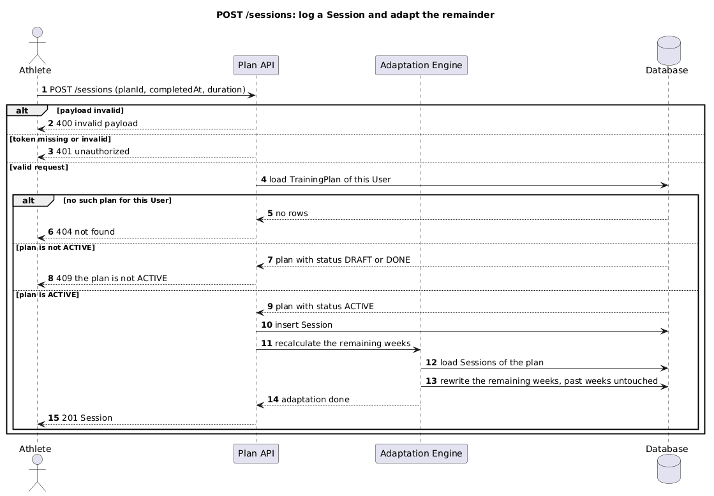

# POST Log a completed Session

Logs a completed workout against the Athlete's ACTIVE TrainingPlan and triggers recalculation of the
remaining weeks. Adaptation runs in-process on the write path, see ADR-0001.

## Identification

| Method | Path | operationId |
|---|---|---|
| POST | /sessions | logSession |

## Document history

| Date | Task | Description | Author |
|---|---|---|---|
| 2026-07-30 | example package | Initial version | Svetlana Fomina |

## Request

### Path and query parameters

None.

### Body

| Field | Required | Type | Values | Description |
|---|---|---|---|---|
| planId | required | string (uuid) | an ACTIVE TrainingPlan of this User | The plan the Session belongs to. |
| completedAt | required | string (date-time) | | When the workout was completed. |
| durationMinutes | required | integer | 1 to 600 | Length of the workout. |
| perceivedEffort | optional | integer | 1 to 10 | Athlete rating, used as the adaptation signal. |

## Response

### Body

| Field | Type | Description |
|---|---|---|
| id | string (uuid) | Identifier of the stored Session. |
| planId | string (uuid) | The TrainingPlan the Session belongs to. |
| completedAt | string (date-time) | When the workout was completed. |
| durationMinutes | integer | Length of the workout. |
| perceivedEffort | integer | Athlete rating, if it was provided. |

### Status codes

| Code | Condition | Description |
|---|---|---|
| 201 | Success | Session stored and the remaining weeks adapted. |
| 400 | Payload invalid | Validation error, nothing is stored. |
| 401 | Bearer token missing or invalid | Not authenticated. |
| 404 | No such TrainingPlan for this User | Nothing is disclosed about other Users' plans. |
| 409 | The target plan is not ACTIVE | A Session may only be logged against an ACTIVE plan. |

## Diagram

[`sequence/post-sessions.puml`](../../sequence/post-sessions.puml)

## Flow

| Step | Description | Error handling | Comment |
|---|---|---|---|
| 1 | Receive the request, validate the body against the field ranges | If a required field is missing, or duration is outside 1 to 600, then return 400 | |
| 2 | Resolve the Athlete from the bearer token | If the token is missing or invalid, then return 401 | |
| 3 | Load the TrainingPlan by planId, restricted to this Athlete | If no row is found, then return 404 without revealing whether the plan exists | UC-3, ownership and existence are one answer |
| 4 | Check the plan status | If the status is DRAFT or DONE, then return 409 | A DONE plan is immutable |
| 5 | Insert the Session inside the write transaction | | |
| 6 | Call the Adaptation Engine to recalculate the remaining weeks (1. load the Sessions of the plan in completion order; 2. rewrite the weeks that have not started) | If adaptation fails, then the transaction rolls back and the Session is not stored | ADR-0001, past weeks are never rewritten |
| 7 | Return 201 with the stored Session | | NFR-6, adaptation is inside this response |

---

**How this relates to the contract.** Field names, types and status codes come from
[`api.yaml`](../api.yaml). What this page adds is the flow, the ownership check and the transaction
boundary, which the contract cannot express.
